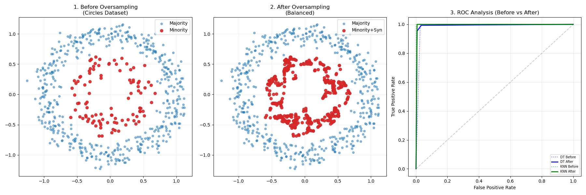
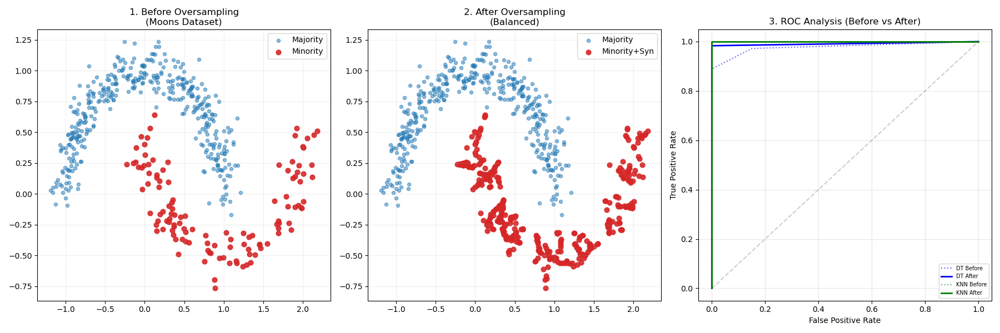
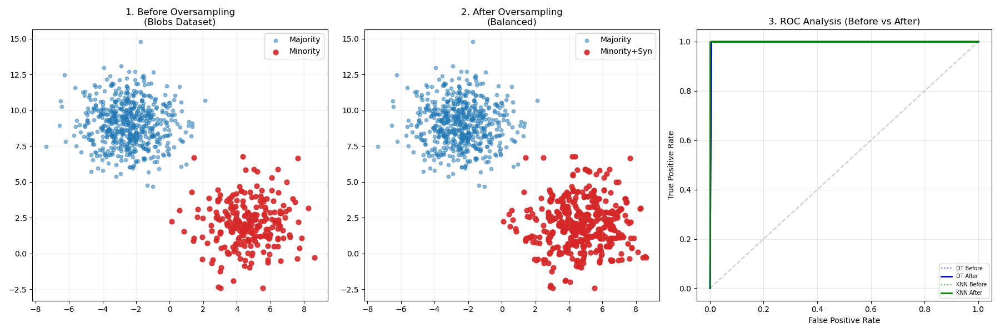
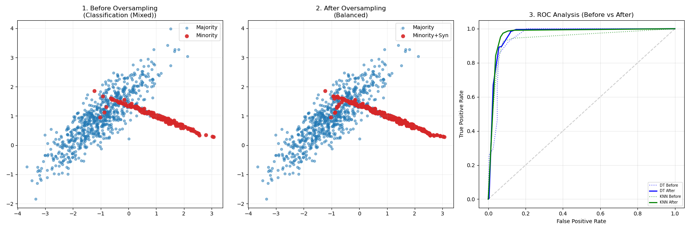
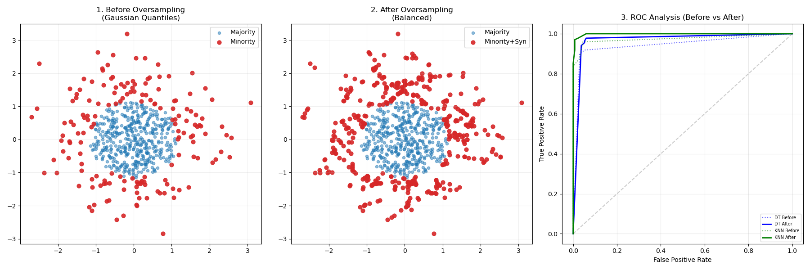

# Custom KNN-Based Oversampling Algorithm

This project implements a custom oversampling technique designed to handle class imbalance in machine learning datasets. Developed as part of the **COME401 Data Mining** course at Uskudar University, this tool uses K-Nearest Neighbors (KNN) and linear interpolation to generate high-quality synthetic samples for minority classes.

## 🚀 Overview

Class imbalance is a common challenge in data mining where one class significantly outperforms another in frequency, leading to biased models. This project provides a custom implementation of an oversampling strategy, similar to SMOTE, to balance datasets effectively before training.

### How it Works
The algorithm follows a 4-step process for each synthetic sample generated
1. **Random Selection:** Picks a point p from the minority class.
2. **Neighbor Identification:** Finds the k nearest neighbors of p within the minority class.
3. **Random Neighbor Selection:** Randomly selects one neighbor from the identified group.
4. **Linear Interpolation:** Creates a new synthetic sample s using the formula:
   $$s = p + (neighbor - p) \times gap$$
   *Where gap is a random value between 0 and 1.*


## ✨ Features

**Custom Algorithm:** Independent implementation using `numpy` and `sklearn.neighbors`.
**Synthetic Data Generation:** Includes a utility to generate 5 types of geometric distributions: Circles, Moons, Blobs, Mixed Classification, and Gaussian Quantiles.
**Performance Benchmarking:** Compares **Decision Tree** and **KNN** classifiers before and after resampling.
**Visualization:** Generates 3-panel plots showing data distribution (Before/After) and ROC curve analysis.

## 📊 Results

The algorithm consistently improves the **Recall** and **F1-Score** for imbalanced datasets. For example, in the Gaussian Quantiles test, the KNN Recall improved from **0.82 to 0.97** after applying the custom oversampling.

| Metric | Before Resampling | After Resampling |
| :--- | :---: | :---: |
| Precision | 0.9756 | 0.9632 |
| Recall | 0.8163 | 0.9704 |
| F1-Score | 0.8889 | 0.9668 |

## 📈 Visualization Results

### Circles Dataset


### Moons Dataset


### Blobs Dataset


### Mixed Dataset


### Gaussian Dataset



## 🛠️ Installation

1. Clone the repository:
   ```bash
   git clone [https://github.com/username/custom-knn-oversampling-algorithm.git](https://github.com/username/custom-knn-oversampling-algorithm.git)

## 📁 Project Structure

```text
custom-knn-oversampling-algorithm/
│
├── src/
│   ├── datasets/        # Synthetic dataset generation
│   ├── sampling/        # Custom KNN-based oversampling algorithm
│   ├── models/          # Model training and evaluation
│   ├── evaluation/      # Performance comparison logic
│   ├── visualization/   # Plots and ROC analysis
│   └── config.py        # Experiment configurations
│
├── main.py              # Entry point
├── requirements.txt
└── README.md
